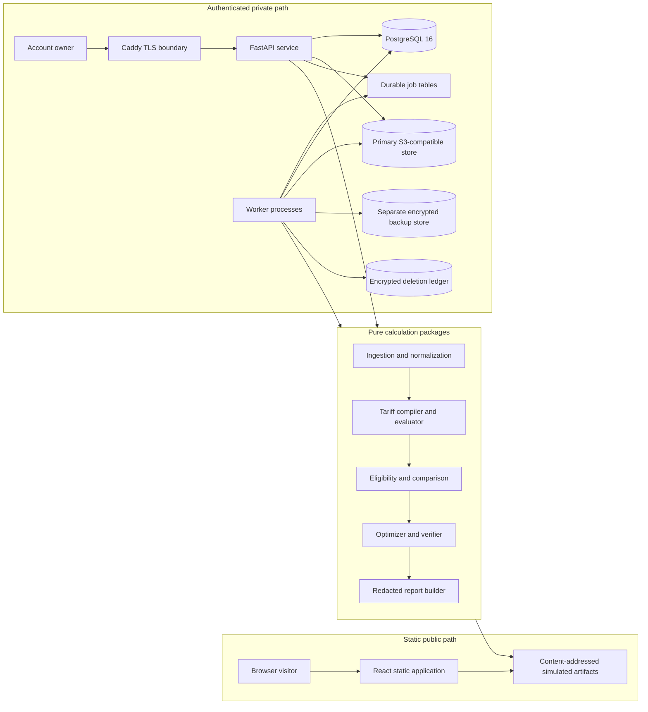

# Architecture overview

## System boundary

RateReplay has two user paths with deliberately different trust models.
The public demo is a static, immutable walkthrough over simulated data.
The private workflow uses authenticated HTTP requests, durable jobs, PostgreSQL, encrypted object storage, and deletion-aware backup and restore controls.

The application admits historical calculations only after source, account, time, component, and numeric contracts pass.
It does not obtain utility credentials or call a utility account API.

## Public demo flow

`scripts/generate_demo_artifacts.py` runs the locked simulated profile through production ingestion, tariff, comparison, optimizer, verifier, and reporting code.
It writes canonical JSON objects named by SHA-256 and an allowlisted manifest under `artifacts/demo`.
The generated manifest hash is embedded in the browser bundle.

The browser accepts only the declared logical IDs and media types.
It verifies the manifest hash, allowlist hash, and object hash before parsing a payload.
It issues only static `GET` requests and creates no account, job, cookie, upload, or mutable server state.

The public path is therefore a product demonstration, not a bypass around private authorization.
The complete contract is in [architecture/public-demo.md](architecture/public-demo.md).

## Private request and job flow

The private browser authenticates through a host-only secure session cookie and supplies a same-origin CSRF token for mutations.
Caddy is the only externally reachable service in the reference topology.
The API authorizes the account owner, validates a canonical request, and creates or finds an idempotent durable operation.

Long-running import, replay, comparison, scenario, report, retention, and deletion work is leased from PostgreSQL by workers.
Lease expiry permits retry after worker loss.
Attempt-scoped artifacts remain unpublished until a generation-fenced finalizer wins the result claim.
The database permits zero duplicate successful results for one semantic calculation identity and owner scope.

The browser polls durable jobs no more than once per second and honors one bounded `Retry-After` response.
Rate limits use fixed route classes and HMAC-digested identifiers.
Forwarded client identity is used only when the immediate peer belongs to an explicitly configured trusted proxy network.

## Calculation boundaries

The ingestion package validates Green Button ESPI relationships or the admitted PG&E CSV structure and normalizes energy to integer watt-hours.
Canonical profile content excludes persistence identity and preserves only calculation-relevant ordered values.

The tariff compiler validates a declarative definition against locked source hashes, component service windows, eligibility rules, exact integer bounds, and the supported intermediate representation.
Historical replay uses integer and rational arithmetic and rounds only at declared line-item boundaries.

Comparison evaluates each candidate independently.
Any unknown eligibility fact, unclassified active component, missing source, or unsupported difference-making component blocks a winner and supported-charge difference.

The optimizer lowers the same tariff intermediate representation used by replay.
It solves supported cost, changed reference entries, completion index sum, and stable slot order lexicographically.
An independent verifier replays the selected schedule and checks constraints before publication.
Small frozen cases use a separate exhaustive oracle that shares no solver constraint construction.

## Persistence and identity

PostgreSQL owns resource identity, lifecycle state, immutable calculation manifests, durable leases, findings, authorization generations, and deletion fences.
Raw uploads and generated binary artifacts use the object-store abstraction with content hashes and lifecycle metadata.

Operation identity and semantic identity are separate.
Operation identity scopes retries for one owner, endpoint, idempotency key, and canonical request hash.
Semantic identity hashes the calculation contract, canonical profile, tariff vector, account facts, reconciliation policy, scenario, and solver configuration.
Owner identity remains an authorization boundary and is not part of semantic content.

## Deletion, backup, and restore

A deletion creates an external `PREPARED` control record before the database lifecycle fence.
The fence blocks new ordinary work before the suppressive `REQUESTED` record is committed.
Workers then remove database rows, objects, queued work, and generated artifacts with resumable checkpoints.

Backups are separately credentialed and encrypted.
They retain PostgreSQL custom-format dumps and a content-addressed object manifest for at most 30 days.
Individual backups are not rewritten after deletion.

A restore enters a fresh quarantine database and object namespace.
The restore verifies the backup and encrypted ledger, reapplies every suppressive deletion, holds unresolved preparations, and produces an instance-bound exposure artifact.
The application network may be attached only after the exposure artifact verifies.
The detailed state machine is in [architecture/deletion-contract.md](architecture/deletion-contract.md), and the operator path is in [operations/backup-restore.md](operations/backup-restore.md).

## Release topology

The reference release contains Caddy, the static web application, FastAPI, workers, one migration job, PostgreSQL 16, a primary S3-compatible service, and a separately credentialed backup service.
Only Caddy publishes host ports.
Metrics and health endpoints remain on internal networks.

The topology is qualified only at `LOCAL_REPRODUCIBLE` evidence level.
The repository does not claim hosted service identity, storage durability, public ACME operation, hosted encryption, or hosted rollback.
See [architecture/authentication-and-deployment.md](architecture/authentication-and-deployment.md) and [operations/deployment-rollback.md](operations/deployment-rollback.md) for the frozen operational contract.

## Source layout

- `apps/api` contains authenticated HTTP routes and request-boundary controls.
- `apps/worker` contains durable worker and operator commands.
- `apps/web` contains the private workflow and static public demo.
- `packages/ingestion` contains ESPI, CSV, normalization, and simulated-profile adapters.
- `packages/tariffs` contains source-locked compilation, billing, admission, and comparison.
- `packages/optimizer` contains scenario validation, lowering, solving, and independent verification.
- `packages/persistence` contains PostgreSQL, object, backup, restore, job, audit, retention, and deletion adapters.
- `packages/reports` contains the allowlisted redacted export.
- `evidence` contains committed machine-readable results.
- `docs/evidence` contains human-readable milestone interpretations and reproduction commands.
